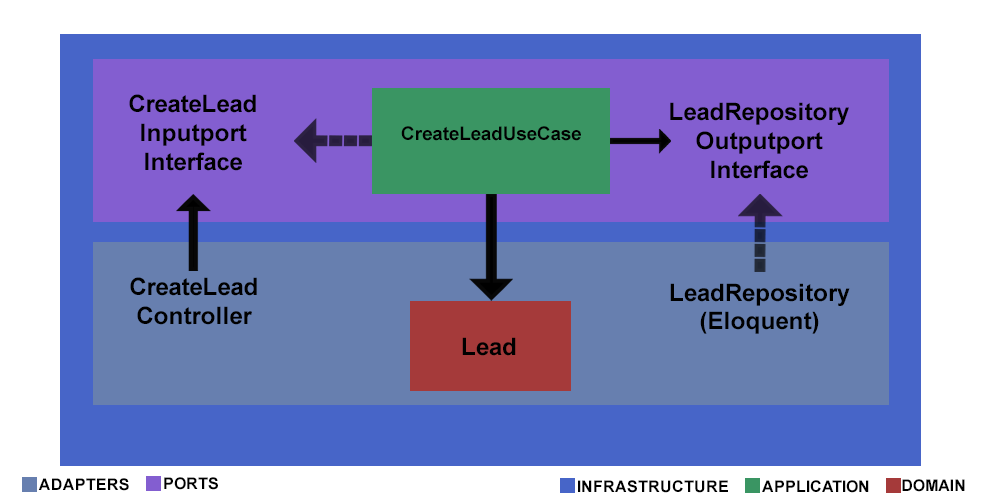
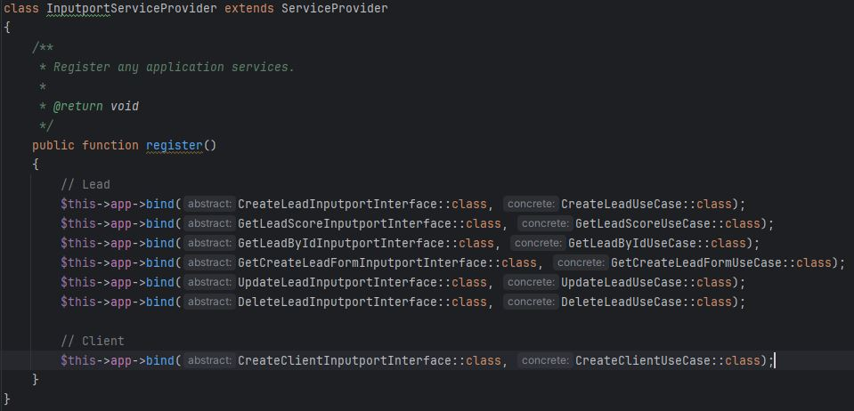

## CodeChallenge: Desarrollo de Aplicación con PHP (Laravel).

¡Bienvenido/a al repositorio de mi prueba técnica para el puesto de programador PHP (Laravel)! En este repositorio, encontrarás el código fuente y la documentación correspondiente a la aplicación desarrollada como parte del proceso de selección.

### Descripción del Proyecto

Este proyecto consiste en el desarrollo de una API REST utilizando el framework PHP Laravel. La aplicación tiene como objetivo el CRUD del recurso "Lead".

### Características Principales

- Arquitectura Hexagonal.
- Test unitarios y de integracion.
- Docker.
- Swagger.

### Estructura del proyecto
La estructura es la de una aplicación Laravel, incluyendo un directorio en raiz llamado "CodeChallenge".
En este directorio existen 2 dominios, Lead y CLient, los cuales tienen la siguiente estructura:
- Application: Casos de uso, donde se implementa la lógica.
- Domain: Dominio, donde se define la lógica.
- Intrastructure: Componentes, recursos y servicios que la aplicación necesita para funcionar.
  - Inputadapter: Componentes que implementan los Inputport para la entrada de datos.
  - Inputport: Interfaces para entrada de datos.  
  - Outputadapter: Componentes que implementan los Outputport para la salida de datos.
  - Outputport: Interfaces para salida de datos.

En el siguiente gráfico se puede ver cómo funciona la arquitecrura hexagonal, con el ejemplo del dominio Lead.

(lo se, no es un hexagono...)

- En  `ROJO` tenemos el dominio (Lead), totalmente aislado y sin ninguna dependencia.
- En  `VERDE` Tenemos Application (CreateLeadUseCase), los casos de uso, que hace uso de los puertos de salida (LeadRepositoryOutputportInterface).
- En  `MORADO`, los puertos (interfaces), que hacen funcion de "cortafuegos".
  - Puerto de entrada (CreateLeadInputportInterface) que es implementado por el caso de uso (CreateLeadUseCase).
  - Puerto de salida (LeadRepositoryOutputportInterface) que es implementado por el adaptador de salida (LeadRepository)
- En  `AZUL`, los adaptadores (clases concretas).
  - Adaptador de entrada (CreateLeadController) que hace uso del puerto de entrada (CreateLeadInputportInterface).
  - Adaptador de salida (LeadRepository) que es implementado por el puerto de salida (LeadRepositoryOutputportInterface).

Esto no hay quien lo entienda, ¿verdad?, vamos a verlo en una caso práctico, crear un "Lead".
Todo empieza con las rutas de Laravel que usarán un Controlador:
1. Se usa el CreateLeadController

   Este controlador usa el puerto de entrada, usa la interfaz CreateLeadInputportInterface, no usa una clase concreta.
2. Esta interfaz es implementada por el caso de uso CreateLeadUseCase que hace uso del puerto de salida, la interfaz LeadRepositoryOutputportInterface, no usa una clase concreta.
3. Este puerto de salida es implementado por el adaptador de salida LeadRepository.

Para hacer uso de todas estas interfaces usamos el mágico [Service Container de Laravel](https://laravel.com/docs/10.x/container) que nos ayuda a inyectar interfaces.
Haciendo un "bind" podemos indicar que cuando se inyecte una interfaz determinada se instancie una clase concreta:

### Requisitos del proyecto
- Git
- Docker

### ¿Cómo lo ponemos en marcha?
1. Abrir una terminal.
2. Descargar el repositorio: `git clone https://github.com/palatinum/CodeChallenge.git`
3. Entrar en el directorio del proyecto: `cd CodeChallenge`
4. Crear el .env: `cp .env.example .env`
5. Ejecutar docker: `docker compose up -d`
6. Ejecutar la instalacion de dependencias: `docker exec -it cc-app composer install`
7. Ejecutar migraciones: `docker exec -it cc-app php artisan migrate`
8. Abrir en el navegador la [documentación](http://localhost/api/documentation).

### Testing
Tests unitarios: tests/Unit/CodeChallenge/Lead/Domain/LeadTest.php
Tests de integración: tests/Feature/CodeChallenge/Lead/Infrastructure/Inputadapter/Http/APIRest/CreateLeadControllerTest.php

Solo hay tests unitarios para la Clase Lead (Dominio) y tests de integración de la clase CreateLeadController (adaptador de entrada).

#### ¿Cómo ejecutar los tests?

Ejecutar en la terminar: `docker exec -it cc-app vendor/bin/phpunit`
